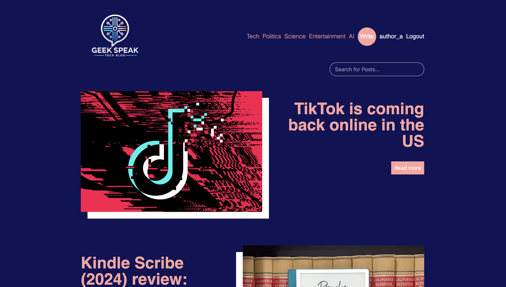
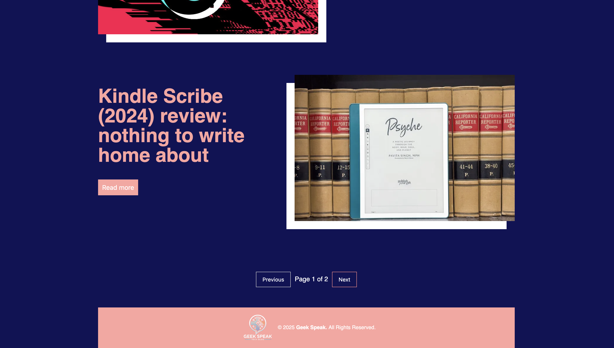
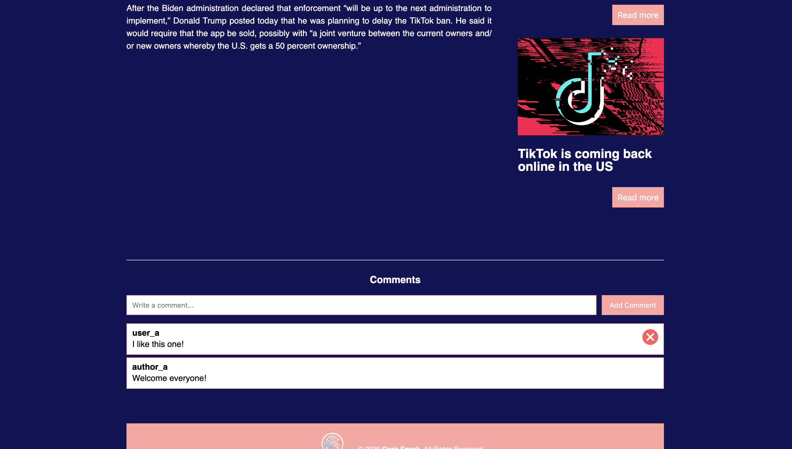
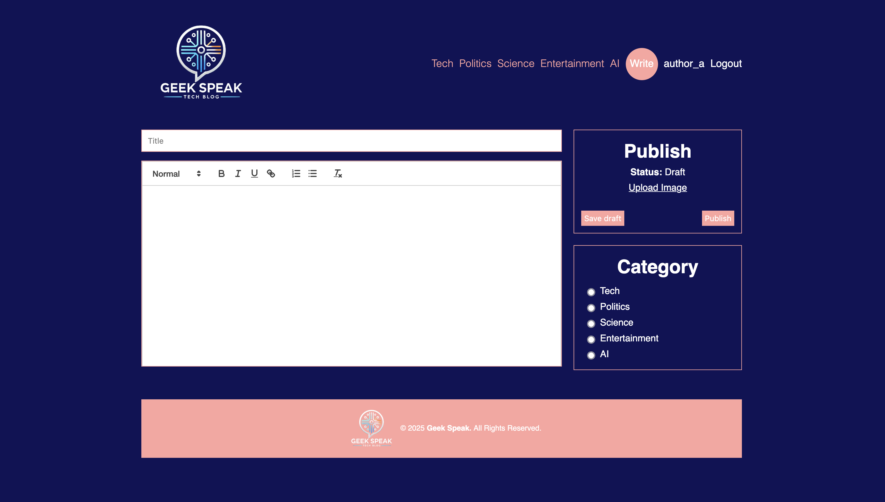
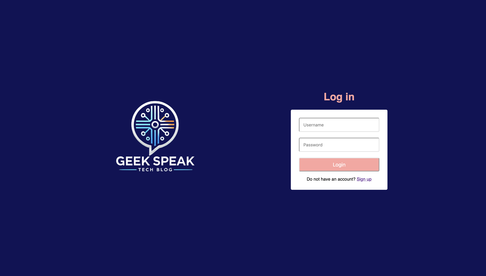
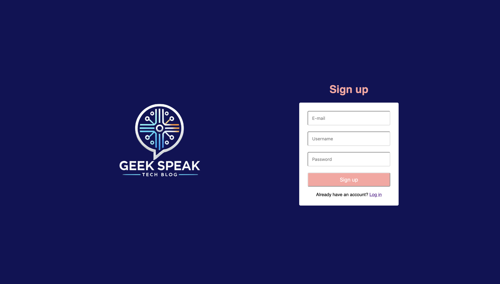
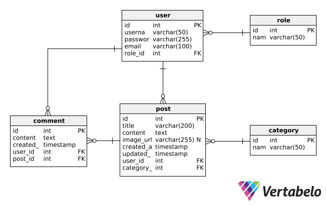

# Full-Stack Blog Platform (Geek Speak)

A modern blogging platform built with React, Node.js, and PostgreSQL, featuring user roles, content management, and interactive features.

## Features

### User Authentication & Authorization
- User registration with email verification
- JWT-based authentication
- Role-based access control with following user types:
  - Administrator (full system access)
  - Author (content creation and management)
  - Authenticated User (commenting and interaction)
  - Guest (read-only access)

### Content Management
#### Posts (Protected Features)
- Create new posts (Admin, Author)
- Edit posts (Admin, Post Owner)
- Delete posts (Admin, Post Owner)
- Upload images for posts (Admin, Author)
- Assign categories to posts (Admin, Author)

#### Comments (Protected Features)
- Add comments (Authenticated Users)
- Delete own comments (Comment Owner)
- Moderate comments (Admin, Post Owner)

### Administrative Features (Admin Only)
- User Management (TODO)
  - View user list
  - Modify user roles
  - Delete users
- Content Moderation
  - Manage all posts and comments

### Public Features
- View posts and comments
- Search posts by title
- Filter posts by category

 ## Inside the App
<div align="center">
    <p><strong>Home page</strong></p>
    
    <br></br>
    
    <br></br>
    <p><strong>Single Post view</strong></p>
    
    <br></br>
    
    <br></br>
    <p><strong>Create Post page</strong></p>
    
    <br></br>
    <p><strong>Login & Register page</strong></p>
    
    
</div>

## Technologies

### Frontend
- React.js
- React Router for navigation
- Redux for state management
- Axios for API communication
- SCSS for styling

### Backend
- Node.js
- Express.js
- JSON Web Tokens (JWT) for authentication
- Multer for file uploads
- Bcrypt for password hashing

### Database
- PostgreSQL

## Prerequisites
- Node.js (v23.3.0 or higher)
- PostgreSQL (v14.15 or higher)
- npm or yarn package manager

## Installation and Setup

1. Clone the repository
```bash
git clone https://github.com/bskrobich/tech-blog.git
cd tech-blog
```

2. Database Setup
```bash
# Create PostgreSQL database
createdb tech_blog
```

3. Backend Setup
```bash
cd api
npm install
cd db
node create-tables.js
node seed-tables.js
cd ..
npm run dev
```

4. Frontend Setup
```bash
cd client
npm install
npm run dev
```

## Database Schema
<div align="center">
    
</div>

## API Documentation

Basic API endpoints structure:

- Auth
  - POST /api/auth/register
  - POST /api/auth/login
  - POST /api/auth/logout

- Posts
  - GET /api/posts
  - GET /api/posts/search
  - GET /api/posts/:id
  - POST /api/posts
  - PUT /api/posts/:id
  - DELETE /api/posts/:id

- Comments
  - GET /api/comments
  - POST /api/comments
  - DELETE /api/comments/:id
